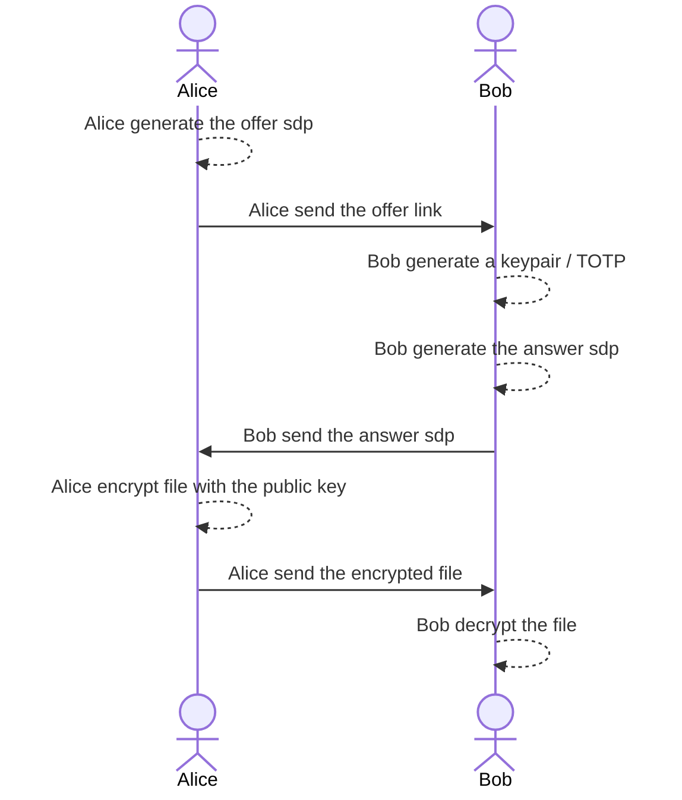

# Zero share

A secure P2P file sharing using WebRTC without a server.

## How it works?

Alice want to send a file to Bob

```mermaid
sequenceDiagram
    actor Alice
    actor Bob
    Alice-->>Alice: Alice generate the offer sdp
    Alice->>Bob: Alice send the offer link
    Bob-->>Bob: Bob generate a keypair / TOTP
    Bob-->>Bob: Bob generate the answer sdp
    Bob->>Alice: Bob send the answer sdp
    Alice-->>Alice: Alice encrypt file with the public key
    Alice->>Bob: Alice send the encrypted file
    Bob-->>Bob: Bob decrypt the file
```
