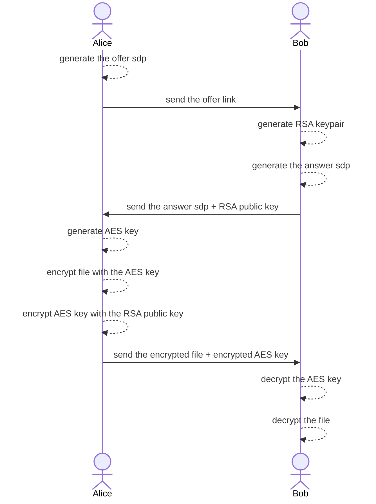

# Zero share

A secure P2P file sharing using WebRTC.

## Features

- Generate SDP connection for WebRTC data channel
- Send multiple files peer to peer using WebRTC
- PGP Encryption
- Responsive UI
- Open-source license
- Zero server side (only use public STUN servers)

## Usage

1. The sender go to <https://zero-share.github.io/>
2. The sender generate offer link, copy the offer link, and send it to the receiver
3. The receiver open the offer link, copy the answer code, and send it to the sender
4. The sender paste the answer code to the input box and accept answer
5. The sender can now select files and send files to the receiver

[demo](https://user-images.githubusercontent.com/8283616/232250894-e86213e7-17e6-449d-be22-0307ca929745.webm)

## How it works

Alice want to send a file to Bob



encryption: PGP (RSA-OAEP-1024, AES-128)

## Development

Requirements

- Node (^16.14 || >=18)
- NPM

Installation

```sh
npm install
```

Run dev (hot reload)

```sh
npm run dev
```

Tests

```sh
npm run test
```

Lint and Format

```sh
npm run lint
npm run format
```

## Deployment

The deployment will using this [Github Workflow](https://github.com/zero-share/zero-share.github.io/blob/main/.github/workflows/static.yml) to trigger the Github Action to build the Github Pages. Because we want to use the domain `zero-share.github.io` instead of my personal one.

For self-host or local deployment, you can run `npm run build` to build the static files. This no need the server side of svelte.

## Contributing

We welcome contributions from the community! If you'd like to contribute to the project, follow these steps:

1. Fork the repository on GitHub.
2. Create a new branch and make changes.
3. Test your changes by running `npm run test`.
4. Ensure your code is properly formatted and linted by running `npm run lint` and `npm run format`.
5. Commit and the commit message should following [Conventional Commits](https://www.conventionalcommits.org/en/v1.0.0/).
6. Create a Pull Request on the original repository, describing the changes you've made and the problem they solve.

For feature requests, please open an issue on the GitHub repository to discuss your ideas with the maintainers.

## Known Issues

1. There is a high percent chance that your internet will block the Google public STUN server. I recommend to check with this website <https://icetest.info/>.
2. Sometimes gets blocked by the firewall during sending files.
